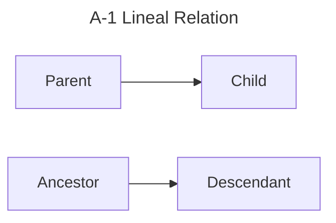
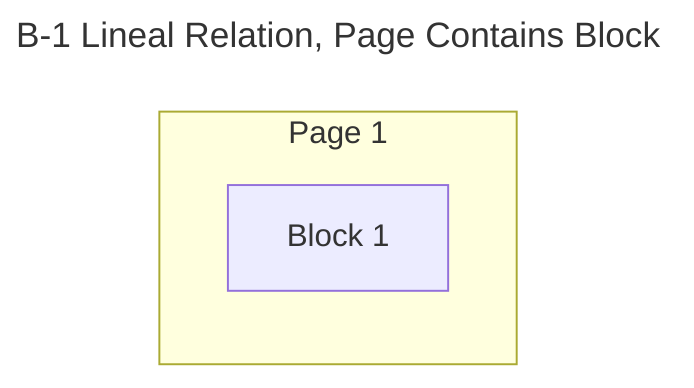
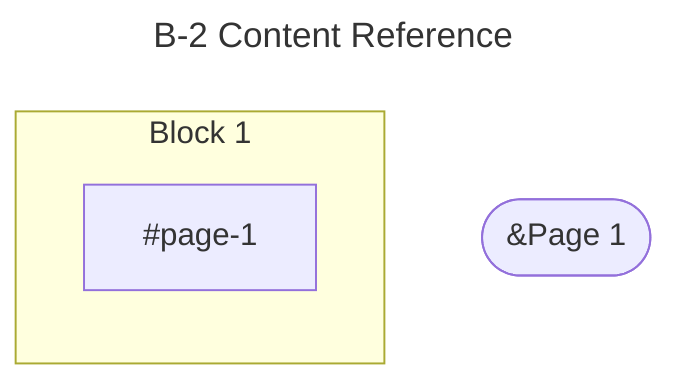
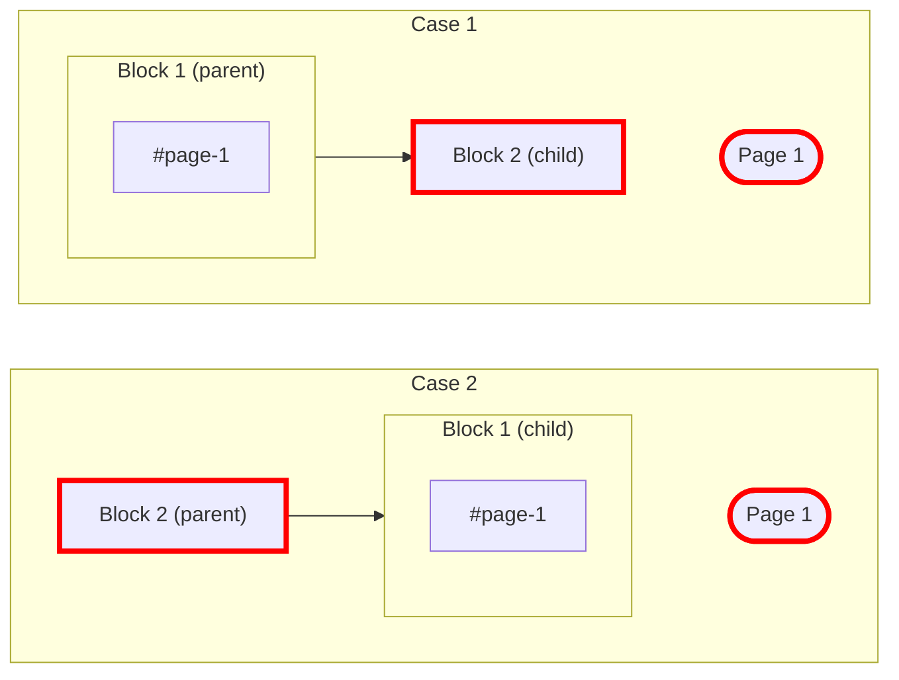
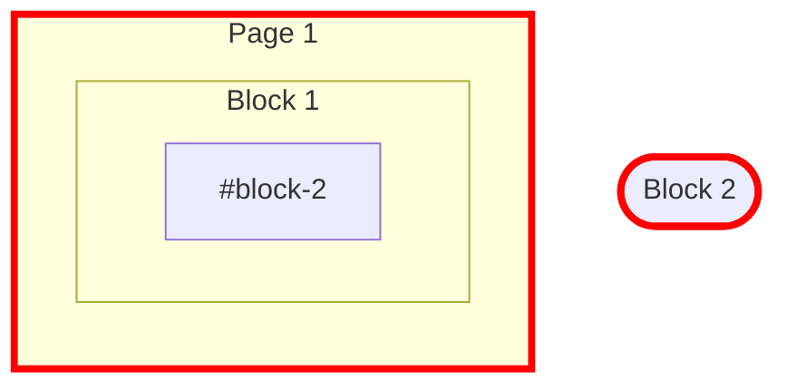
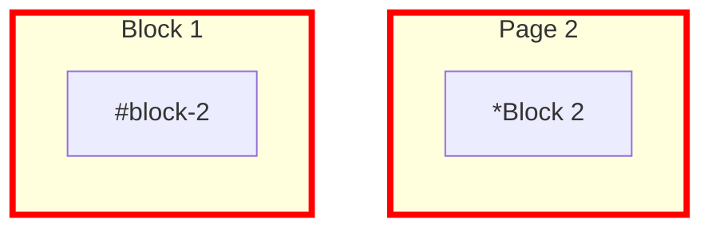
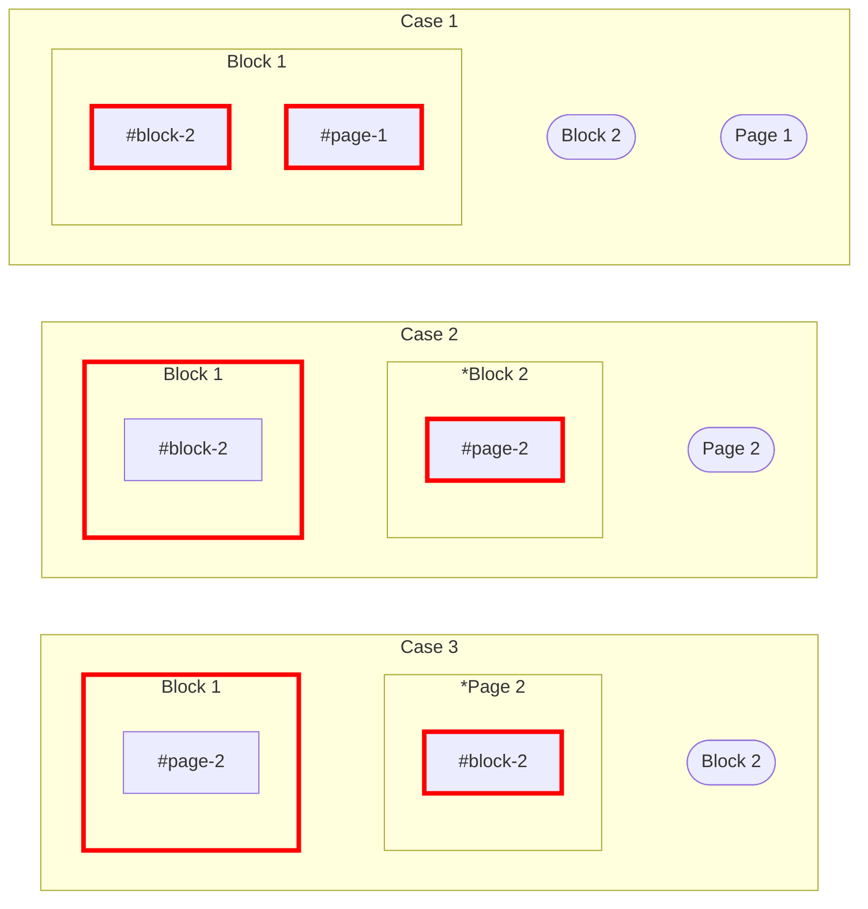

#### Type A --> Type B (7 total)

#### Basic

#### Case "A-1 LR x B-1 LR" (0 total)

NA

#### Case "A-1 LR x B-2 CR" (2 total)

#### Case "A-2 CR x B-1 LR" (2 total)

#### Case "A-2 CR x B-2 CR" (3 total)

