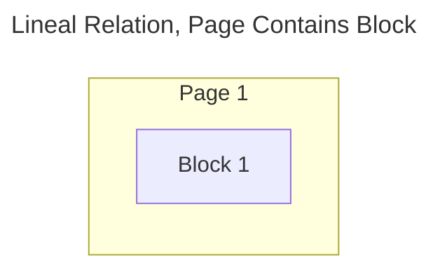
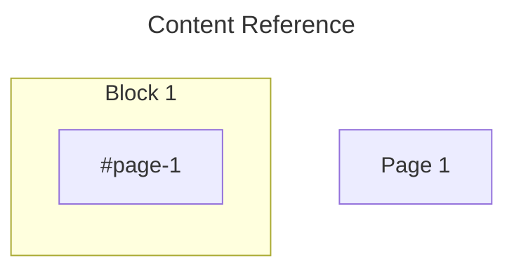
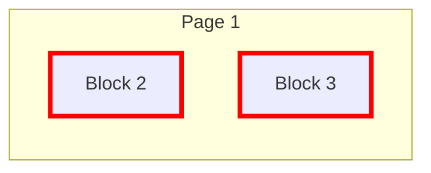
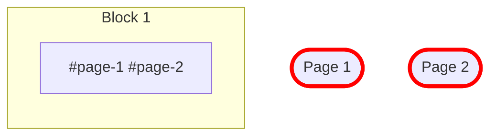
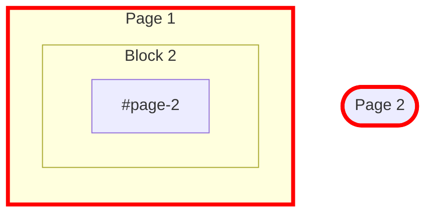
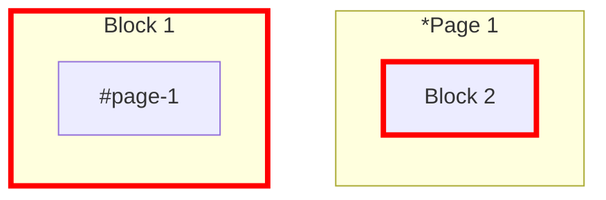

### Type B --> Type B (4 total)

#### Basic

```mermaid
---
title: Lineal Relation, Page Contains Block
---
graph LR
    subgraph 1P[Page 1]
      1Pb[Block 1]
    end
```

```mermaid
---
title: Content Reference
---
flowchart LR
    subgraph 1B[Block 1]
      1Bp[#page-1]
    end
    1B~~~2P[Page 1]
```

#### Case "B1LR x B1LR" (1 total)

```mermaid
graph LR
    subgraph 1P1[Page 1]
      1P1b1[Block 2]
      1P1b2[Block 3]
      style 1P1b1 stroke:#F00,stroke-width:4px
      style 1P1b2 stroke:#F00,stroke-width:4px
    end
```

#### Case "B2CR x B2CR" (1 total)

```mermaid
flowchart LR
    subgraph 1B1[Block 1]
      1B1p[#page-1 #page-2]
    end
    1B1~~~1P1([Page 1])
    1P1~~~1P2([Page 2])
    style 1P1 stroke:#F00,stroke-width:4px
    style 1P2 stroke:#F00,stroke-width:4px
```

#### Case "B1LR x B2CR" (2 total)

```mermaid
graph LR
    subgraph 1P[Page 1]
      subgraph 1Pb[Block 2]
        1Pbp[#page-2]
      end
    end
    2P([Page 2])
    1P~~~2P
    style 1P stroke:#F00,stroke-width:4px
    style 2P stroke:#F00,stroke-width:4px
```

```mermaid
graph LR
    subgraph 1B[Block 1]
      1Bp[#page-1]
    end
    subgraph 2P[*Page 1]
      2Pb[Block 2]
    end
    1B~~~2P
    style 1B stroke:#F00,stroke-width:4px
    style 2Pb stroke:#F00,stroke-width:4px
```
