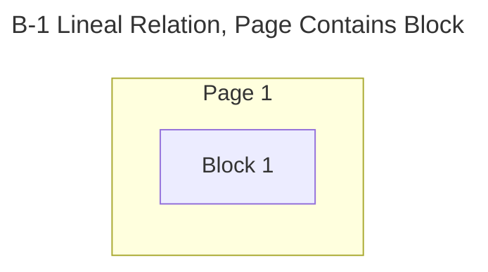
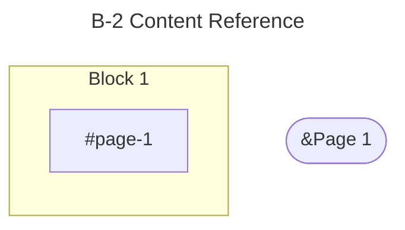
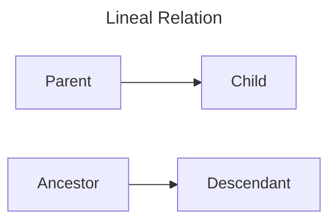
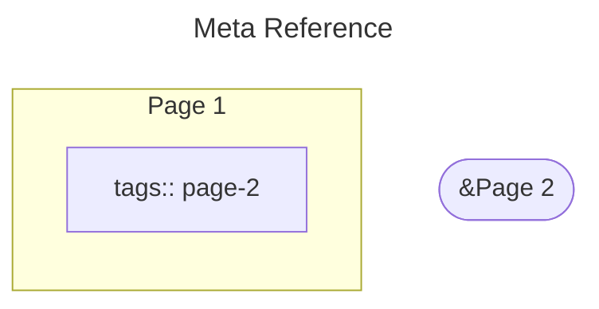
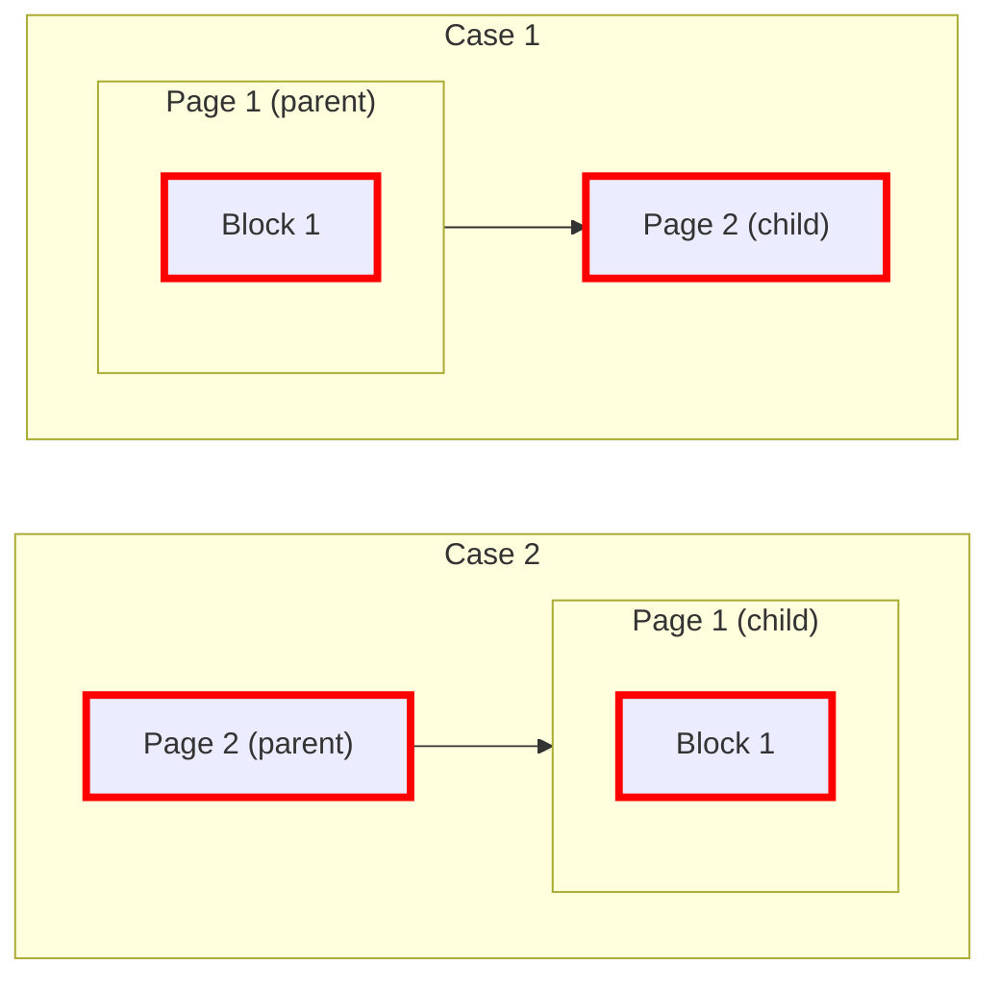
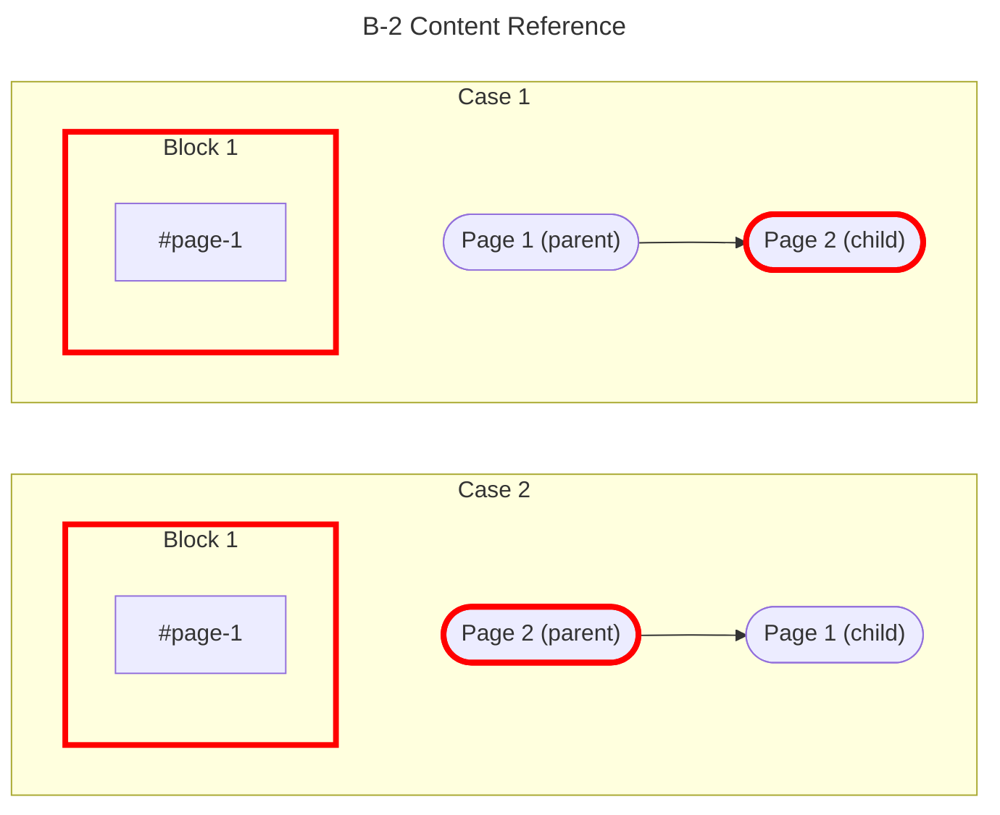
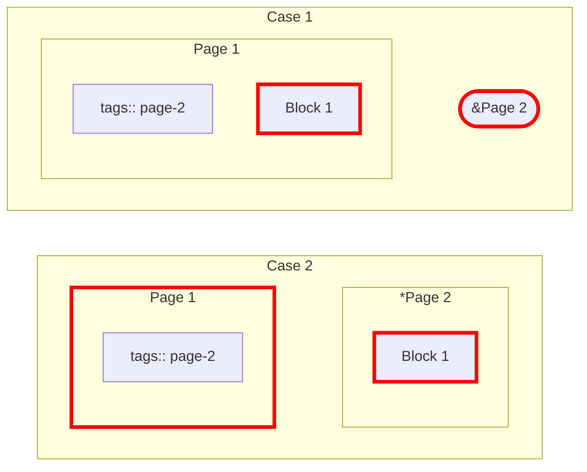
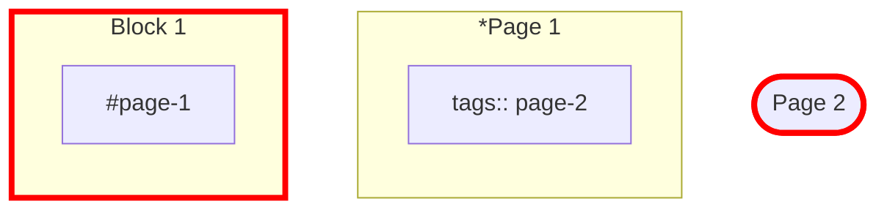

#### Type B --> Type C (7 total)

#### Basic

#### Case "B-1 LR x C-1 LR" (2 total)

#### Case "B-2 CR x C-1 LR" (2 total)

#### Case "B-1 LR x C-2 MR" (2 total)

#### Case "B-2 CR x C-2 MR" (1 total)

